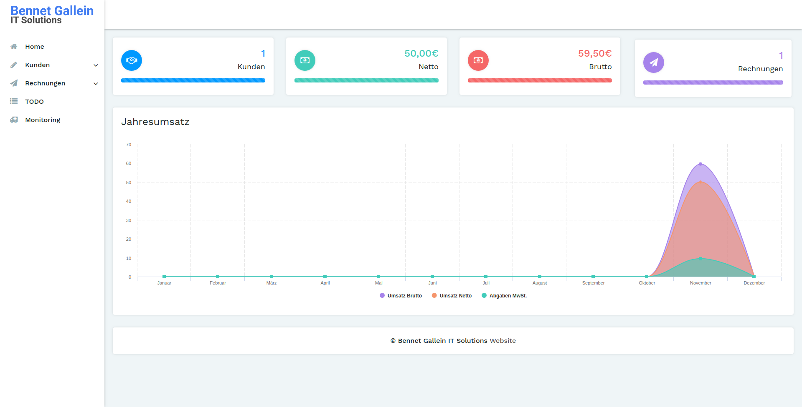

# books
> Buchhaltungssystem im Web.

books ist ein kleines Buchhaltungssystem geschrieben in PHP for Einzelnpersonen und kleine Firmen.

## Installation

**WARNING:** Dieses Projekt befindet sich im Anfangsstadium. Benutzer-login sowieso Datenbank installation sind noch nicht integriert, sollten aber bald folgen!

Requirements:
- MariaDB Datenbank
- PHP 7.2
- Composer (http://getcomposer.org)

```shell
git clone https://github.com/bennetgallein/books
cd books
cp config.example.json config.json
composer install && composer dump-autoload -o
```

Bearbeite die `config.json` und trage die gefragten Daten ein.

Danach kann die Seite im Browser geöffnet werden.

### Erste Schritte

Das Setup wird nun automatisch alle Datenbanken erstellen und einen Standard Benutzer anlegen.


## Features


* Kunden Managment
* Rechnungsmanagment
* TODO Listen
* Monitoring (WIP)


## Contributing

Pull-request sind offen. Neue Features sollten auf einem `feature/`-branch auf einem Fork erfolgen, fixes auf dem master-branch.
Issues sind auch offen. Für Featurewünsche habe ich immer ein Ohr offen!

## Lizenz

One really important part: Give your project a proper license. Here you should
state what the license is and how to find the text version of the license.
Something like:

"The code in this project is licensed under MIT license."